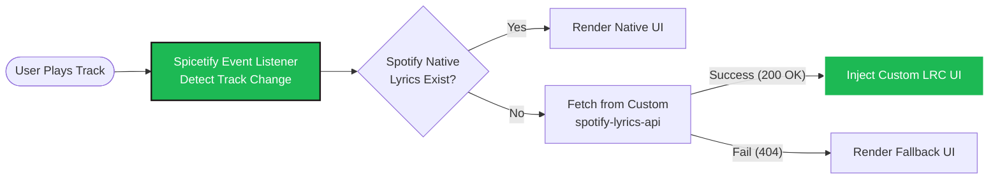
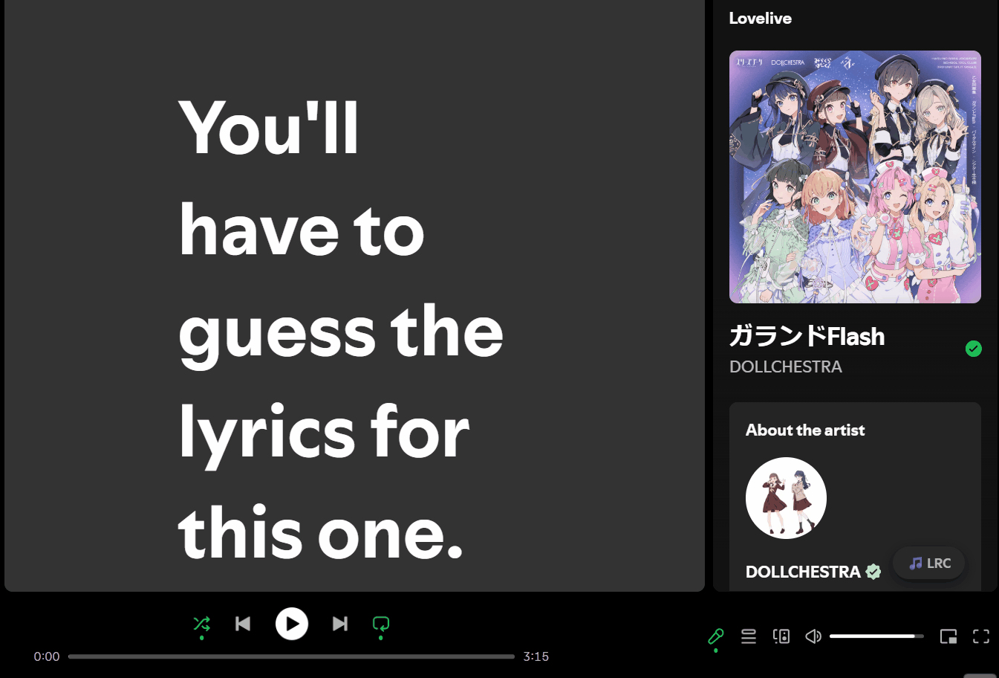

# 🎧 Kamishiro Spotify LRC Player



A powerful, highly integrated custom lyrics player for Spotify. It bridges the gap between official limitations and a premium, synchronized-lyrics experience by connecting to your self-hosted API.

## 🎬 Demonstration (Using Spicetify)


## ✨ Features
* **Seamless UI Integration**: Natively injects a custom `🎵 LRC` toggle button into the Spotify UI.
* **Dynamic Gradient Theme**: Automatically extracts the dominant color from your album art via the Canvas API to generate an immersive, self-adapting gradient background.
* **Smart Syncing**: 
  * **Desktop (Spicetify)**: Deeply integrated with the `Spicetify.Player` API for zero-latency seeking and event-driven state management.
  * **Web (Chrome Ext)**: Uses synthetic `PointerEvent` dispatching to safely bypass React's internal event listeners for precise manual seeking.
* **State Preservation**: Uses a custom radar algorithm to detect and remember your scroll position, ensuring a perfect browsing experience when toggling the lyrics panel.

## ⚙️ Configuration (Crucial Step)

Before installing, you must point the client to your own backend API (refer to the `spotify-lyrics-api` repository).

Open `kamishiro-lyrics.js` (or your Chrome Extension background script) and update the API base URL to match your deployment:
```javascript
// Change this to your local or deployed API URL
const API_BASE_URL = "[http://127.0.0.1:8000/api/lyrics](http://127.0.0.1:8000/api/lyrics)"; 
```

## 🚀 Installation

### For Desktop (Spicetify - Recommended)
1. Ensure [Spicetify](https://spicetify.app/) is installed.
2. Copy the configured `kamishiro-lyrics.js` to your Spicetify `Extensions` folder.
3. Run the following commands in your terminal:
   ```bash
   spicetify config extensions kamishiro-lyrics.js
   spicetify apply
   ```

### For Web (Chrome Extension)
1. Clone this repo: `git clone https://github.com/yourusername/spotify-lrc-player.git`
2. Open Chrome and navigate to `chrome://extensions/`.
3. Enable "Developer mode" (top right corner).
4. Click "Load unpacked" and select this project folder.
5. Refresh your Spotify Web Player.

## 🛠️ Tech Stack
* **Frontend**: Vanilla JavaScript (ES6+), DOM Manipulation, Canvas API.
* **Environment Interop**: Spicetify CLI (Desktop) / Chrome Extension Manifest V3 (Web).
* **Communication**: REST API (via `fetch`) for real-time `.lrc` sync data retrieval.

---
*Created by KamishiroRio. Built for Spotify Power-Users.*